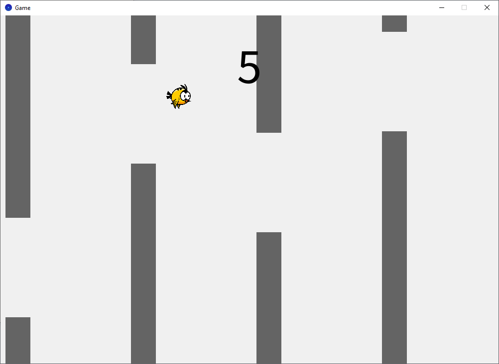
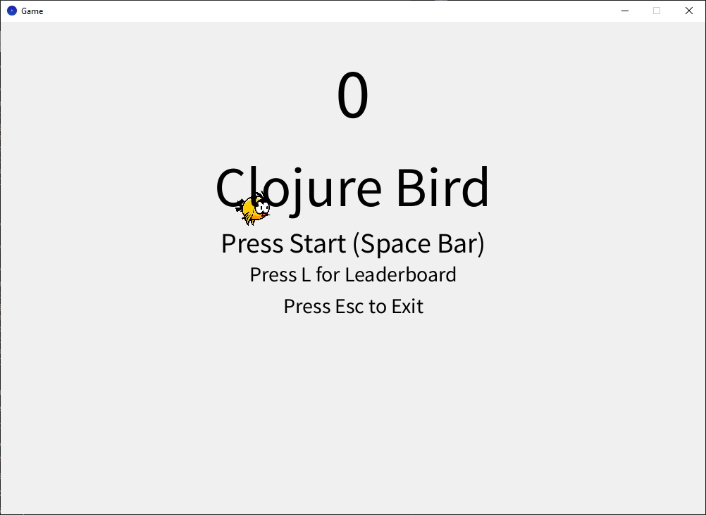

# clojure-bird

### STARTING APPLICATION ###
- Requirements: Java 11+, Leiningen 2.x.
- From the project root: `lein run`
- REPL: `lein repl`, then `(require 'game-project.core)` and `(-main)`.
- Assets (bird.png) are loaded from the repo root/resources; run from project root so paths resolve.

### DATABASE CONNECTION ###
- Uses SQLite at `resources/scores.db`; `ensure-db!` creates the `scores` table on first run.
- No external DB needed. To wipe the board, delete `resources/scores.db` before starting.
- Scores are written locally via `next.jdbc` + `sqlite-jdbc`.

### FUNCTIONS EXPLAINED ###
game-project.core
    ensure-db! - Creates the scores table if missing  
    save-score! - Inserts a name/score row into SQLite  
    load-top-scores - Pulls the top 10 scores (desc) for the leaderboard  
    refresh-leaderboard! - Refreshes cached leaderboard data  
    poll-key - Debounces key presses so UI/game actions fire once per press  
    begin-save-flow - Opens the name-entry UI after a game over  
    handle-name-input - Handles typing, backspace, save (Ctrl), cancel (Alt)  
    setup - Quil setup, color mode, image load, DB init  
    random-range - Integer helper for obstacle placement  
    reset-game - Resets player, obstacles, score, and UI flags  
    clamp-to-top - Keeps the player from leaving the top of the screen  
    circle-rect-collide? - Circle vs rect collision for hit detection  
    handle-menu-state - Menu bob animation, start/leaderboard toggles  
    handle-game-state - Gravity, jumping, obstacle spawning/movement, scoring, collisions, save flow  
    update-state - Chooses menu vs game handling each frame  
    draw-leaderboard - Renders the top scores overlay  
    draw-state - Draws background, obstacles, player sprite, HUD, menus, save modal  
    -main - Entry point that starts the Quil sketch

### CONTROLS ###
Menu: Space to start, L to toggle leaderboard, Esc to quit  
In Game: Tap/hold a key (e.g., Space) to flap upward
Game Over: R to restart, S to save score, M to return to menu  
Saving: Type name (12 chars max); Ctrl saves, Alt cancels; saves go to `resources/scores.db`  
Leaderboard: Press L from the menu to view the top scores (local only)  

### SOURCES ###
- Clojure for the Brave and True: Learn the Ultimate Language and Become a Better Programmer: Higginbotham Daniel
- http://quil.info/api
- https://github.com/uncomplicate/neanderthal/tree/master
- https://wiki.planetchili.net/index.php/Beginner_C%2B%2B_Game_Programming_Series (Good for learning game logic)
- https://github.com/vaskee001/cljinvaders
- https://cljdoc.org/d/com.github.seancorfield/next.jdbc/1.3.1086/doc/getting-started
- https://www.pngegg.com/en/png-nghbg

